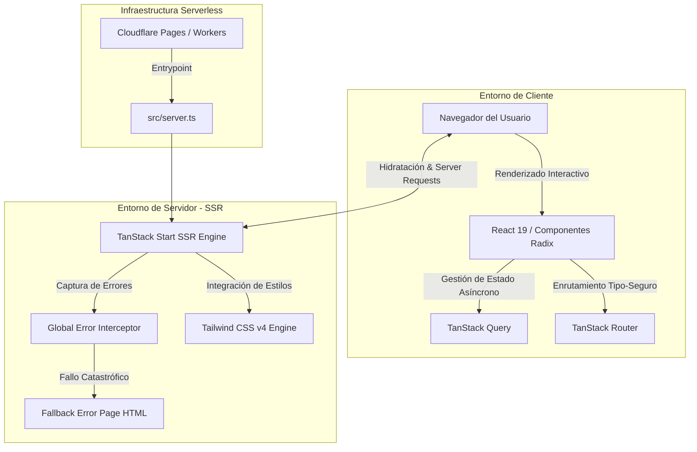

# Gestor de Reclamos — Auditor Agéntico de Facturación de Siniestros
### 🚀 Equipo *Superpoderosos* · Hackiathon 2026

Este repositorio contiene el código fuente de la aplicación **Gestor de Reclamos**, una plataforma moderna de auditoría automática de facturación y documentación enviada por talleres mecánicos a compañías aseguradoras. A través del uso de agentes de Inteligencia Artificial y análisis cruzado de datos, el sistema detecta de forma autónoma discrepancias, cobros duplicados y calcula un **Puntaje de Riesgo** para prevenir el fraude a tiempo.

---

## 📋 Tabla de Contenido
1. [Descripción General y Caso de Negocio](#-descripción-general-y-caso-de-negocio)
2. [Arquitectura del Sistema](#-arquitectura-del-sistema)
3. [Flujo de Trabajo del Agente (LUCHO)](#-flujo-de-trabajo-del-agente-lucho)
4. [Estructura del Proyecto](#-estructura-del-proyecto)
5. [Pila Tecnológica (Tech Stack)](#-pila-tecnológica-tech-stack)
6. [Instalación y Configuración](#-instalación-y-configuración)
7. [Estrategia de Despliegue e Infraestructura](#-estrategia-de-despliegue-e-infraestructura)

---

## 💡 Descripción General y Caso de Negocio

En la industria de seguros, la revisión y liquidación de siniestros automotrices suele ser un proceso manual, lento y vulnerable a errores o fraudes. Los talleres mecánicos pueden reportar cobros inflados, facturas duplicadas o mano de obra no justificada.

El **Gestor de Reclamos** automatiza la auditoría cruzando múltiples variables clave:
* **Frecuencia Inusual:** Historial de reclamos sospechosos por asegurado, taller o póliza.
* **Desviación de Tarifas:** Montos reclamados superiores al promedio del ramo.
* **Patrones de Repetición:** Talleres, intermediarios o beneficiarios recurrentemente asociados a casos observados.
* **Proximidad de Vigencia:** Reclamos reportados en fechas sospechosamente cercanas al inicio o fin de la cobertura.
* **Calidad Documental:** Detección de documentos incompletos, ilegibles o inconsistentes.
* **Similitudes en Narrativas:** Uso de IA generativa para detectar narrativas de siniestros sospechosamente idénticas entre diferentes casos.

---

## 🏛️ Arquitectura del Sistema

La arquitectura sigue el patrón moderno de **Server-Side Rendering (SSR)** unificado, ofreciendo un frontend interactivo ultrarrápido y un procesamiento del lado del servidor robusto y seguro.



### 1. Núcleo del Frontend (Client-Side)
* **Framework React 19:** Utiliza la última versión de React, aprovechando las mejoras de rendimiento y la integración nativa de transiciones y hooks de estado.
* **Enrutamiento Tipo-Seguro (TanStack Router):** Enrutamiento basado en archivos (`src/routes`). Garantiza una navegación robusta y segura en tiempo de compilación.
* **Sincronización de Datos (TanStack Query):** Administra el caché de datos del servidor de manera declarativa, simplificando la obtención y actualización de datos en tiempo real.
* **Interfaz de Usuario (shadcn/ui & Radix):** Componentes visuales accesibles y estilizados con **Tailwind CSS v4** mediante una integración CSS-first de alta eficiencia.

### 2. Capa del Servidor (Server-Side Rendering - SSR)
* **TanStack Start:** Framework que unifica la renderización en el servidor y la hidratación en el cliente sin configuraciones complejas, optimizando el SEO y el tiempo de carga inicial.
* **Gestor de Errores Catastróficos (SSR Error Capture):** 
  * Los servidores web basados en `h3` (como Nitro, el motor de TanStack Start) suelen enmascarar los errores de renderizado en el servidor transformándolos en una respuesta JSON `500` genérica.
  * El sistema implementa un interceptor global de errores (`src/lib/error-capture.ts`) que captura de forma asíncrona la traza original del error.
  * Si ocurre un fallo crítico durante el renderizado, el servidor (`src/server.ts`) intercepta la respuesta fallida y genera una página HTML estática y limpia (`src/lib/error-page.ts`) para evitar que el usuario visualice errores de sistema.

---

## 🤖 Flujo de Trabajo del Agente (LUCHO)

El núcleo de la automatización se apoya en **LUCHO**, el agente inteligente integrado en el flujo de reclamos:

1. **Recepción:** El taller carga la factura y la documentación del siniestro.
2. **Análisis de Políticas y Contratos:** El sistema valida la cobertura contra el contrato de seguro en tiempo real.
3. **Auditoría Agéntica (AI Lucho):**
   * El agente IA evalúa la coherencia de la descripción física del siniestro versus los repuestos y mano de obra cobrados.
   * Utilizando herramientas de voz o texto, el ejecutivo ajustador puede interactuar con **Lucho** en el taller para evaluar detalles específicos.
4. **Cálculo del Puntaje de Riesgo:** Se genera un índice de riesgo porcentual.
5. **Dashboard Antifraude:** Los reclamos con alto puntaje son marcados y canalizados al panel del ejecutivo antifraude para auditorías detalladas antes del pago.

---

## 📁 Estructura del Proyecto

```text
Gestor de Reclamos/
├── .gitignore
├── bun.lock                 # Archivo de bloqueo para bun (entorno original)
├── bunfig.toml              # Configuración de Bun
├── components.json          # Configuración de Componentes de shadcn/ui
├── eslint.config.js         # Linter de código
├── package.json             # Dependencias del proyecto y scripts
├── tsconfig.json            # Configuración de TypeScript
├── vite.config.ts           # Configuración estándar de Vite + TanStack Start + Tailwind v4
├── wrangler.jsonc           # Configuración para despliegue en Cloudflare Pages
└── src/
    ├── components/          # Componentes reutilizables
    │   └── ui/              # Primitivas UI basadas en Radix
    ├── hooks/               # React Hooks personalizados (ej. use-mobile)
    ├── lib/                 # Utilidades comunes e infraestructura de errores
    │   ├── error-capture.ts # Interceptor out-of-band de errores SSR
    │   ├── error-page.ts    # Generador de página de error HTML estática
    │   └── utils.ts         # Funciones de utilidad (ej. cn para Tailwind)
    ├── routeTree.gen.ts     # Árbol de rutas auto-generado por TanStack
    ├── router.tsx           # Instanciación y configuración del router
    ├── server.ts            # Entrypoint del servidor SSR y normalizador de errores
    ├── start.ts             # Instancia de inicio y middleware de TanStack Start
    ├── styles.css           # Estilos globales y directivas de Tailwind CSS v4
    └── routes/              # Páginas de la aplicación (Enrutamiento por archivos)
        ├── __root.tsx       # Layout raíz, inyección de metadatos SEO y QueryClient
        └── index.tsx        # Página de bienvenida, descripción de pasos e integrantes
```

---

## 🛠️ Pila Tecnológica (Tech Stack)

### Core & Framework
* **React 19.2.0** — Interfaz de usuario declarativa.
* **TanStack Start 1.167.50** — Full-stack framework para SSR y streaming de datos.
* **TypeScript 5.8.3** — Tipado estático estricto.

### Estilado y Presentación
* **Tailwind CSS v4.2.1** — Nueva versión del motor CSS utilitario con compilación nativa en Vite (`@tailwindcss/vite`).
* **Radix UI Primitives** — Componentes de UI sin estilo, accesibles y robustos.
* **Lucide React 0.575.0** — Set de iconos vectoriales modernos.

### Herramientas de Compilación y Servidor
* **Vite 7.3.1** — Herramienta de compilación ultrarrápida.
* **Vite TSConfig Paths 6.0.2** — Soporte para alias de rutas (ej. `@/*`).
* **Cloudflare Pages / Wrangler** — Hosting serverless global de alto rendimiento y baja latencia.

---

## 🚀 Instalación y Configuración

### Requisitos Previos
* **Node.js** v18 o superior, o **Bun** v1.0 o superior (recomendado para desarrollo).

### 1. Clonar el repositorio e instalar dependencias
```bash
# Instalar dependencias usando npm
npm install

# O si tienes Bun configurado localmente
bun install
```

### 2. Levantar el servidor de desarrollo
```bash
npm run dev
# o con bun
bun run dev
```
El servidor levantará en `http://localhost:3000` (o el puerto configurado disponible).

### 3. Compilación para producción
```bash
npm run build
# o con bun
bun run build
```

### 4. Previsualización local del entorno de producción
```bash
npm run preview
# o con bun
bun run preview
```

---

## ☁️ Estrategia de Despliegue e Infraestructura

El sistema está configurado nativamente para ser desplegado en **Cloudflare Pages** o **Cloudflare Workers** mediante el archivo de configuración `wrangler.jsonc`.

* **Ventajas del despliegue serverless:**
  * **Latencia Ultra Baja:** Despliegue en la red de borde global de Cloudflare.
  * **Escalabilidad Infinita:** Manejo de solicitudes concurrentes de liquidación de facturas sin preocuparse por la provisión de servidores.
  * **Costo-Eficiencia:** Cero costos fijos en base a consumo de CPU/Memoria fraccionado.
  * **Compatibilidad de API:** Habilitado mediante `nodejs_compat` para soportar las librerías necesarias para el agente de IA.

---

*Desarrollado con pasión por el **Equipo Superpoderosos** en la Hackiathon 2026. ¡Revolucionando la auditoría de seguros con Inteligencia Artificial!*
