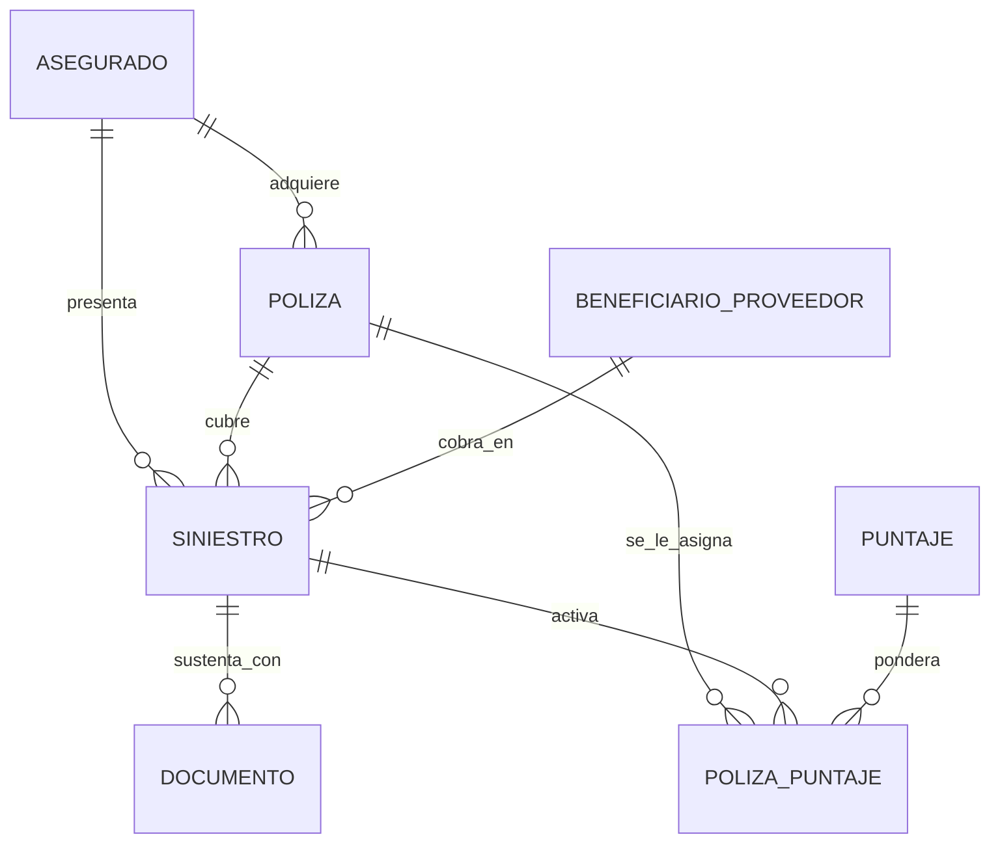

# 📊 Diccionario y Explicación del Dataset: Gestión de Reclamos AI (Lucho DataSet)

Este documento detalla la estructura, relaciones y el significado de los datos contenidos en el archivo consolidado **`Gestion_Reclamos_AI_Lucho_DataSet.xlsx`**, el cual fue extraído de la base de datos relacional de Supabase para el sistema de **Seguro Inteligente**.

---

## 🗺️ Modelo de Relaciones (Arquitectura de Datos)

El siguiente diagrama muestra cómo se conectan las 10 tablas del ecosistema de reclamaciones y análisis de fraude:

---

## 📂 Diccionario de Tablas

A continuación se describe cada una de las pestañas incluidas en el archivo de Excel:

### 1. `ASEGURADO`
* **Propósito**: Almacena el perfil maestro de los clientes que compran seguros.
* **Campos Clave**:
  * `id`: Identificador único secuencial del asegurado.
  * `codigo`: Código interno del asegurado (ej. `ASEG-001`).
  * `tipo_documento` y `nro_documento`: Cédula, RUC, Pasaporte, etc.
  * `antiguedad`: Años de permanencia del cliente.
  * `score_cliente`: Puntuación de perfilamiento de riesgo de fraude simulado (0 a 100).

---

### 2. `POLIZA`
* **Propósito**: Registro de contratos activos o históricos de seguros adquiridos por los clientes.
* **Campos Clave**:
  * `id`: Identificador único de la póliza.
  * `id_asegurado`: Clave foránea que asocia la póliza al cliente (`ASEGURADO.id`).
  * `ramo`: Línea de negocio (ej. `Vehículos`, `Hogar`, `Salud`).
  * `prima`: El costo comercial de la póliza.
  * `suma_asegurada`: El límite máximo de cobertura contratado.
  * `deducible`: Monto que debe asumir el cliente en caso de reclamo.
  * `estado_poliza`: Situación contractual (`Vigente`, `Vencida`, `Cancelada`).

---

### 3. `BENEFICIARIO_PROVEEDOR`
* **Propósito**: Directorio de talleres, clínicas, condominios, peritos o terceros que reciben el desembolso del seguro o brindan el servicio.
* **Campos Clave**:
  * `id`: Identificador único del beneficiario/proveedor.
  * `tipo`: Clasificación comercial (ej. `Taller Automotriz`, `Clínica`, `Condominio`).
  * `monto_promedio_reclamado`: Media histórica de los siniestros presentados por este proveedor.
  * `pct_casos_observados`: Porcentaje de auditorías previas donde se detectó alguna sospecha o anomalía (0.0 a 1.0).

---

### 4. `SINIESTRO`
* **Propósito**: Tabla central de reclamos. Contiene toda la información transaccional sobre eventos reportados.
* **Campos Clave**:
  * `id`: Identificador de la reclamación.
  * `id_poliza`: Póliza bajo la cual se realiza el reclamo (`POLIZA.id`).
  * `id_asegurado`: Cliente que sufre el incidente (`ASEGURADO.id`).
  * `id_beneficiario`: Taller/Clínica receptor del pago (`BENEFICIARIO_PROVEEDOR.id`).
  * `cobertura`: Qué amparo específico se reclama (ej. `Choque y Colisión`, `Robo Domiciliario`, `Inundación`).
  * `dias_desde_inicio_poliza`: Días transcurridos entre la fecha de inicio de vigencia de la póliza y la ocurrencia del siniestro (un número bajo activa señales de alerta por *fraude precoz*).
  * `etiqueta_fraude_simulada`: Indicador booleano que señala si el caso fue clasificado finalmente como fraudulento.

---

### 5. `DOCUMENTO`
* **Propósito**: Expediente de evidencias y documentos entregados para acreditar el reclamo.
* **Campos Clave**:
  * `id_siniestro`: Relación directa con el reclamo (`SINIESTRO.id`).
  * `tipo_documento`: Denominación física (ej. `Factura de Reparación`, `Informe Policial`, `Certificado Médico`).
  * `entregado` y `legible`: Estados binarios clave para el compliance de la liquidación.
  * `inconsistencia_detectada`: Descripciones de texto donde se alerta sobre tachaduras, alteraciones, o anomalías del documento.

---

### 6. `PUNTAJE`
* **Propósito**: Matriz de reglas de negocio parametrizables para el motor de fraude. Define cuánto "pesa" cada alerta detectada.
* **Campos Clave**:
  * `codigo`: Identificador de la señal de alerta (ej. `A`, `B`, `C`, etc.).
  * `senial`: Descripción de la regla (ej. *Denuncia de robo transcurridas más de 48 horas*).
  * `desde` y `hasta`: Rangos cuantitativos de evaluación.
  * `formula`: Lógica matemática/regla del negocio.
  * `puntaje`: Penalización en puntos a sumar cuando se cumpla la condición.

---

### 7. `POLIZA_PUNTAJE`
* **Propósito**: Matriz transaccional donde se registran qué señales de fraude específicas fueron activadas por qué reclamo/póliza, acumulando los puntos definidos en `PUNTAJE`.
* **Campos Clave**:
  * `id_poliza`: Póliza evaluada.
  * `id_siniestro`: Siniestro específico evaluado.
  * `senial`: Código de señal gatillada.
  * `puntaje`: Puntaje exacto sumado a esta transacción.

---

### 8. `SCORE_RIESGO`
* **Propósito**: Rangos de umbral de puntuaciones acumuladas para clasificar el nivel de alerta general y sugerir flujos de trabajo.
* **Campos Clave**:
  * `rango_desde` y `rango_hasta`: Límites del puntaje acumulado de fraude.
  * `nivel`: Semáforo de alerta (ej. `Verde` (Bajo), `Amarillo` (Medio), `Rojo` (Alto)).
  * `accion_sugerida`: Camino de compliance sugerido (ej. *Aprobación Directa*, *Auditoría de Documentación*, *Investigación de Campo*).

---

### 9. `REGLA_CRITICA`
* **Propósito**: Reglas de descalificación o alertas de fraude duro que detienen inmediatamente el proceso de reclamación o activan auditorías obligatorias.
* **Campos Clave**:
  * `codigo`: Identificador secuencial de la regla.
  * `regla`: Explicación declarativa de la alerta (ej. *Siniestros reportados el mismo día del inicio de la vigencia de la póliza*).

---

### 10. `LISTA_RESTRICTIVA`
* **Propósito**: Base de control de listas negras de personas y entidades con antecedentes fraudulentos documentados.
* **Campos Clave**:
  * `nombre_completo`: Nombre de la persona o razón social.
  * `nro_documento`: RUC / Cédula para el match directo con clientes o proveedores.

---

## 💡 Cómo interactúan los datos para detectar Fraude

1. Se genera un **`SINIESTRO`** asociado a una **`POLIZA`** de un **`ASEGURADO`**, direccionado a un **`BENEFICIARIO_PROVEEDOR`**.
2. Al ingresar el reclamo, el motor de reglas recorre la matriz **`PUNTAJE`** e inserta registros en **`POLIZA_PUNTAJE`** por cada señal que se cumpla (ej: si el siniestro ocurrió en los primeros 10 días de vigencia de la póliza, se genera una alerta tipo `A` sumando puntos de riesgo).
3. Se suma el puntaje total de **`POLIZA_PUNTAJE`** y se contrasta contra los umbrales de **`SCORE_RIESGO`** para clasificar el caso en color `Rojo` (Investigar), `Amarillo` (Revisar) o `Verde` (Liquidar).
4. Adicionalmente, el RUC del proveedor o la cédula del asegurado se cotejan de manera instantánea contra la **`LISTA_RESTRICTIVA`**.
